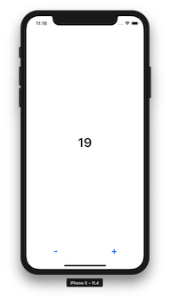

# Counter

This is [ReactComponentKit]() example. Counter is very simple and basic redux example. 

## Screenshot



## What is ReactComponentKit

ReactComponentKit is a library for building UIViewComponent based on Component. Additionary, It architect UIViewController as Redux with MVVM. If you use ReactComponentKit, You can make many scenes(UIViewController) more easily. You can share components among scenes. 

## Define Components

### CountLabelComponent

```swift
import Foundation
import BKRedux
import ReactComponentKit
import SnapKit

class CountLabelComponent: UIViewComponent {
    
    private lazy var label: UILabel = {
        let label = UILabel(frame: .zero)
        label.font = UIFont.boldSystemFont(ofSize: 40)
        label.textColor = UIColor.black
        label.text = "0"
        label.textAlignment = .center
        return label
    }()
    
    override var contentSize: CGSize {
        return label.intrinsicContentSize
    }
    
    override func setupView() {
        addSubview(label)
        label.snp.makeConstraints { (make) in
            make.edges.equalToSuperview()
        }
    }
    
    override func on(state: [String : State]?) {
        guard let count = state?["count"] as? Int else { return }
        label.text = String(count)
    }
}
```

UIViewComponent is just a UIView. You can layout sub views or components in the setupView method by using SnapKit. ReactComponentKit uses SnapKit to layout views. 

### IncrementButtonComponent & DecrementButtonComponent

```swift
import ReactComponentKit
import RxSwift
import RxCocoa

class IncrementButtonComponent: UIViewComponent {
    
    private let disposeBag = DisposeBag()
    private lazy var button: UIButton = {
        let button = UIButton(type: .system)
        button.frame = .zero
        button.setTitle("+", for: [])
        button.titleLabel?.font = UIFont.boldSystemFont(ofSize: 30)

        button.rx.tap.map { IncrementAction(payload: 1) }.bind(onNext: dispatch).disposed(by: disposeBag)
        
        return button
    }()
    
    override func setupView() {
        addSubview(button)
        button.snp.makeConstraints { (make) in
            make.edges.equalToSuperview()
        }
    }
}
```

```swift
import ReactComponentKit
import RxSwift
import RxCocoa

class DecrementButtonComponent: UIViewComponent {
    
    private let disposeBag = DisposeBag()
    private lazy var button: UIButton = {
        let button = UIButton(type: .system)
        button.frame = .zero
        button.setTitle("-", for: [])
        button.titleLabel?.font = UIFont.boldSystemFont(ofSize: 30)
        
        button.rx.tap.map { DecrementAction(payload: 1) }.bind(onNext: dispatch).disposed(by: disposeBag)
        
        return button
    }()
    
    override func setupView() {
        addSubview(button)
        button.snp.makeConstraints { (make) in
            make.edges.equalToSuperview()
        }
    }
}
```

You can make above button components more general like as ActionButtonComponent. However, I made button components separately. 

## Define Actions

### IncrementAction & DecrementAction

```swift
import Foundation
import BKRedux

struct IncrementAction: Action {
    let payload: Int
    
    init(payload: Int = 1) {
        self.payload = payload
    }
}
```

```swift
import Foundation
import BKRedux

struct DecrementAction: Action {
    let payload: Int
    
    init(payload: Int = 1) {
        self.payload = payload
    }
}
```
## Define Reducer

```swift
import Foundation
import BKRedux
import RxSwift

func countReducer(name: String, state: State?) -> (Action) -> Observable<ReducerResult> {
    return { action in
        guard let prevState = state as? Int else { return Observable.just(ReducerResult(name: name, result: 0)) }
        
        var newState = prevState
        
        switch action {
        case let increment as IncrementAction:
            newState += increment.payload
        case let decrement as DecrementAction:
            newState -= decrement.payload
        default:
            break
        }
        
        return Observable.just(ReducerResult(name: name, result: newState))
        
    }
}
```

ReactComponent's Reducer returns Rx' Observable for async actions.

## Define ViewModel & State

```swift
import Foundation
import ReactComponentKit
import BKRedux

class CounterViewModel: RootViewModelType {
    override init() {
        super.init()
        store.set(
            state: [
                "count": 0
            ],
            reducers: [
                "count": countReducer
            ])
    }
    
    override func on(newState: [String : State]?) {
        // Send the new state to the sub components
        eventBus.post(event: .on(state: newState))
    }
}
```

RootViewModelType has a redux stroe. You can define state. Also, You can set the reducers, middlewares and postwares. 

## Make Scene(UIViewController)

```swift
import UIKit
import ReactComponentKit

class CounterViewController: UIViewController {
    
    private lazy var viewModel: CounterViewModel = {
        return CounterViewModel()
    }()
    
    private lazy var countLabel: CountLabelComponent = {
        return CountLabelComponent(token: viewModel.token)
    }()
    
    private lazy var incrementButton: IncrementButtonComponent = {
        return IncrementButtonComponent(token: viewModel.token, canOnlyDispatchAction: true)
    }()
    
    private lazy var decrementButton: DecrementButtonComponent = {
        return DecrementButtonComponent(token: viewModel.token, canOnlyDispatchAction: true)
    }()

    override func viewDidLoad() {
        super.viewDidLoad()
        
        view.addSubview(countLabel)
        view.addSubview(incrementButton)
        view.addSubview(decrementButton)
        
        countLabel.snp.makeConstraints { (make) in
            make.center.equalToSuperview()
            make.left.right.equalToSuperview()
        }
        
        decrementButton.snp.makeConstraints { (make) in
            make.left.equalToSuperview()
            make.bottom.equalTo(view.safeAreaLayoutGuide)
            make.width.equalToSuperview().dividedBy(2)
            make.height.equalTo(48)
        }
        
        incrementButton.snp.makeConstraints { (make) in
            make.right.equalToSuperview()
            make.bottom.equalTo(view.safeAreaLayoutGuide)
            make.width.equalToSuperview().dividedBy(2)
            make.height.equalTo(48)
        }
    }

    override func didReceiveMemoryWarning() {
        super.didReceiveMemoryWarning()
    }   
}
```

## MIT License

The MIT License

Copyright © 2018 Sungcheol Kim, https://github.com/skyfe79/Counter

Permission is hereby granted, free of charge, to any person obtaining a copy
of this software and associated documentation files (the "Software"), to deal
in the Software without restriction, including without limitation the rights
to use, copy, modify, merge, publish, distribute, sublicense, and/or sell
copies of the Software, and to permit persons to whom the Software is
furnished to do so, subject to the following conditions:

The above copyright notice and this permission notice shall be included in
all copies or substantial portions of the Software.

THE SOFTWARE IS PROVIDED "AS IS", WITHOUT WARRANTY OF ANY KIND, EXPRESS OR
IMPLIED, INCLUDING BUT NOT LIMITED TO THE WARRANTIES OF MERCHANTABILITY,
FITNESS FOR A PARTICULAR PURPOSE AND NONINFRINGEMENT. IN NO EVENT SHALL THE
AUTHORS OR COPYRIGHT HOLDERS BE LIABLE FOR ANY CLAIM, DAMAGES OR OTHER
LIABILITY, WHETHER IN AN ACTION OF CONTRACT, TORT OR OTHERWISE, ARISING FROM,
OUT OF OR IN CONNECTION WITH THE SOFTWARE OR THE USE OR OTHER DEALINGS IN
THE SOFTWARE.